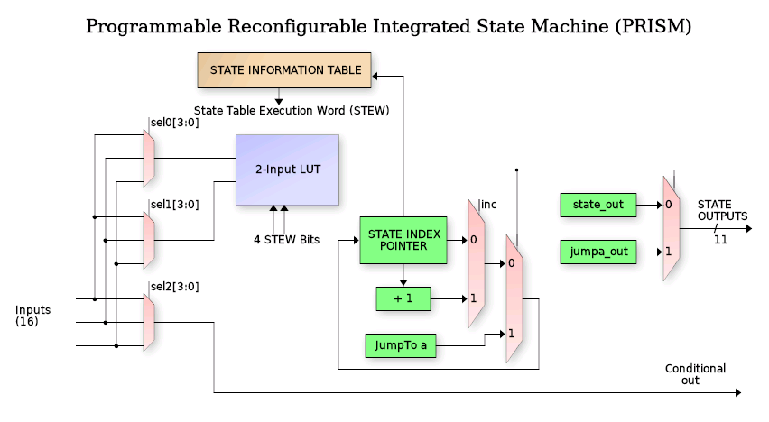
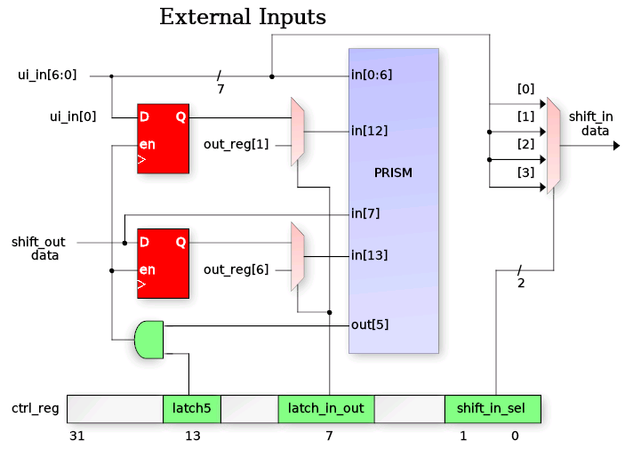
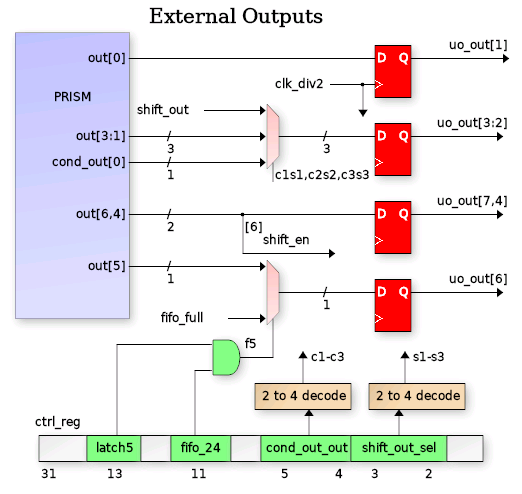
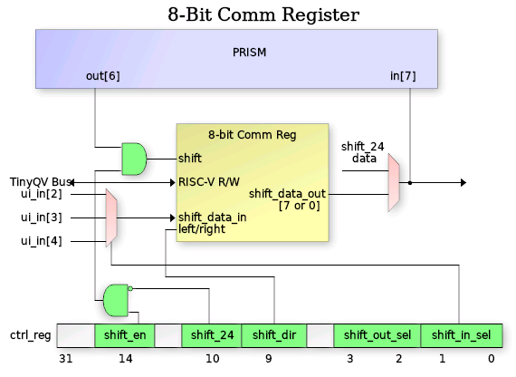

# PRISM: the Programmable Reconfigurable Indexed State Machine

Author: Ken Pettit

PRISM executes a state machine that is loaded at run time.  The state
machine is written as an ordinary Verilog Mealy FSM, a **chroma**, and
compiled by a Yosys backend into a table of 32 **State Execution Words**
(STEWs) of 128 bits plus the configuration words for the datapath.  The
host CPU loads the table, configures the datapath, enables the machine, and
from then on PRISM makes one decision per clock from its 32 inputs and
drives 21 outputs, with no software in the loop.  This document describes
the machine on the IHP sg13g2 8x4 tile.  The design record with the
reasoning behind each feature is [prism_interface.md](prism_interface.md);
the register constants used by the tests are in
`test/user_peripherals/prism/regs.py`.  This is the sg13g2 5x4 tile: the
same RTL as the 8x4 tile without the SRAM macros, so the SRAM FIFOs, the
tracer and the constant table (which lives in the FIFO an SRAM frees) are
described here for completeness but are not on this tile, and the flop FIFO
depth is a build option (`PRISM_FIFO_AW`: 6 = 64 bytes, 5 = 32).

## 1. At a glance

| | |
| --- | --- |
| States | 32, in two banks of 16 |
| State word | 128 bits (STEW), from the CFGMEM latch macros |
| Inputs | 32 per shard, 6 input muxes per state |
| Decision | two 3-input LUTs per state: `if` (tree 0), `else if` / `else` (tree 1) |
| Outputs | 21 per shard, a separate set for the resting state and for each of the two branches |
| Conditional outputs | two per shard, each a 2-input LUT of the current inputs |
| Fracture | one 32-state machine, or two independent 16-state shards |
| Per shard | 24/32-bit count1 (counter or wide shifter), 8-bit count2 with compare, 8-bit comm shifter, 4 constants, 64- or 32-byte FIFO, CRC / counter unit, Manchester recoverer, edge sampler, 4 edge-capture flops, timer 2, interrupt |
| Debug | halt, single step, two breakpoints per shard with entry / if / else-if / exit conditions, live and registered readback |
| Trace | 8x4 tile only |
| Host | TinyQV, 512-byte register region at 0x8000200; CFGMEM loader at 0x8000100 |

Variants of the same RTL: the sg13g2 8x4 tile adds one 512x32 SRAM per
shard (SRAM FIFOs, tracer, constant table); the CMOS5L tile has 16-byte flop
FIFOs and neither the counter mode nor the 32-bit FIFO access.

## 2. The core

The current **state index** (SI, 5 bits) addresses the State Information
Table; the word that comes back is the STEW for that state.  While the
machine sits in a state the STEW's *default outputs* drive the 21 outputs.
Six 5-bit fields of the STEW select six of the 32 inputs.  Muxes 0-2 feed
tree 0, a 3-input LUT programmed by 8 STEW bits; muxes 3-5 feed tree 1.
Tree 0 is the chroma's `if`: when its LUT is true the machine jumps to the
tree 0 target state and drives the *tree 0 outputs* for that one clock.
Tree 1 is the `else if` (or a plain `else`, compiled as an always-true
LUT): it is taken when it matches and tree 0 does not, with its own target
and its own outputs.  When neither fires the machine stays.  Two more LUTs,
2 inputs each (cond 0 from muxes 1 and 4, cond 1 from muxes 3 and 5), drive
the **conditional outputs**, whose value follows the inputs within the
state; a chroma writes them as `cond_out[0] = 1'b0; if (x) cond_out[0] =
1'b1;`.

The **inc bit** starts or continues the auto-loop: in a state with `inc`
set, "no match" moves to the next state instead of staying, and the first
such state is remembered; a later state without `inc` and no match returns
there.  The compiler emits it for the idiom "a chain of tests with a
trailing `else -> next state`", so a scan over several states costs no
decision tree.

STEW layout (`chromas/tinyqv32.cfg`):

| bits | field |
| --- | --- |
| 0 | inc |
| 30:1 | mux 0 .. mux 5 input selects, 5 bits each |
| 35:31 | tree 1 jump target |
| 40:36 | tree 0 jump target |
| 61:41 | default outputs |
| 82:62 | tree 1 outputs |
| 103:83 | tree 0 outputs |
| 111:104 | tree 0 LUT3 |
| 119:112 | tree 1 LUT3 |
| 123:120 | cond 0 LUT2 |
| 127:124 | cond 1 LUT2 |

## 3. Shards and fracturing

The 32 states live in two banks of 16: bank A (CFGMEM "lo" macros, states
0-15) and bank B ("hi", states 16-31).  **Unfractured** (FRAC_CFG = 0)
shard 0 is the whole machine: its SI selects the bank with its top bit,
shard 1's index register silently tracks shard 0's low bits so both banks
are always addressed without a mux, and shard 1's datapath idles (its
registers stay accessible, and shard 0 can use shard 1's FIFO as a second
FIFO, section 8).  **Fractured** (FRAC_CFG = 1) each bank is an independent
16-state machine with its own SI, its own 32 inputs, its own 21 outputs, its
own datapath, its own interrupt and its own debugger.  A chroma compiled
with `tinyqv32_shard.cfg` (16 states) loads into either bank.

The two shards see each other in three ways:

- **Semaphores**: OUT_SEMA_SET (output 19) in one shard sets a sticky flag
  the other shard reads as input 24 and clears with its OUT_SEMA_CLEAR
  (output 15).  If set and clear meet in the same cycle the receiving
  shard's CFG0[24] decides who wins.  The host reads both flags in
  INT_STATUS[3:2].
- **Input 25**: the other shard is halted (registered).
- **Pins**: each shard's PINMUX names a source for every uo_out[7:1] pin, or
  code 7 for "not mine".  A pin claimed by shard 0 goes to shard 0,
  otherwise to shard 1, otherwise to GPIO; a pin freezes while its owning
  shard is halted.

The output and conditional-output masks at 0x44-0x50 gate which of a
shard's outputs reach its datapath while fractured; they reset to zero, so
a fractured configuration must set them.

## 4. Inputs

Every shard has the same 32 inputs.  Bits 0-15 keep the meaning of the
original two-tile PRISM so old chromas read the same; 16 and up carry the
newer features.

| input | meaning |
| --- | --- |
| 0-6 | ui_in[6:0], after the shard's synchroniser select: CFG0[19:18] = 0 two flops, 1 one flop, 2 raw |
| 7 | shift_data: the serial-out bit of the selected shifter |
| 8, 9 | host_in[1:0], written by the host (a byte write to +0x15 toggles bit 0 and clears the interrupt) |
| 10 | count1_term: count1 reached 0 counting down, or the preload / roll-over counting up |
| 11 | count2_cmp: count2 >= COMPARE |
| 12, 13 | latched_in: {shift_data, cond_out[0]} captured by OUT_LATCH, or the latched outputs with CFG0[7], or two FSM flags with CFG0[29] |
| 14 | shift_term: the shift count reached the configured length |
| 15 | count2 == comm |
| 16-19 | input slots, default the four edge-capture flops in_prev[3:0] (section 4.1) |
| 20, 21 | own FIFO flags: empty and full by default, CFG1[25:24] / [27:26] pick almost-empty / almost-full / the other side |
| 22 | crc_ok: the CRC equals CRC_EXPECTED; in counter mode, count >= CRC_EXPECTED |
| 23 | count1_wrap: count1 rolled over counting up |
| 24 | semaphore set by the other shard |
| 25 | the other shard is halted |
| 26, 27 | FIFO B's flags for shard 0 unfractured (CFG1[29:28] / [31:30]); 0 otherwise |
| 28-31 | input slots, default 0; input 28's default is the timer 2 tick (section 11) |

**Input slots** (CFG2, four bits per slot for inputs 16-19 and 28-31) let a
chroma bring other signals into a state's decision: code 0 the slot's
default, 1-4 in_prev[0..3], 5-12 comm[0..7] (so the decision trees decode a
received byte, a USB PID or a command, without a match register per value),
13 comm == K3, 14 flag2, 15 the Manchester bit-valid / sampler edge-pending
flag.

### 4.1 Edge capture (in_prev)

Four flops per shard follow a source each names in CFG1[15:0] (four bits
per flop: 0-6 a ui_in pin after the synchroniser, 8 or 9 a host_in bit).  A
flop captures its source in exactly the cycle a decision tree whose muxes
read that source fires and the transition executes, so `if (pin ^ in_prev0)
-> next` fires once per transition of the pin and re-arms itself.  Two
edges can be watched from one state through tree 0 and tree 1; a flop whose
source the firing tree did not read keeps its value, so several states can
share an edge condition.  Nothing captures while halted, a single step
captures once, and auto-loop transitions never capture.  Program the
sources before enabling: a flop only changes on a capture.  OUT_LATCH
(output 4) and CFG3[26] (the sampler) can capture all four at once.

## 5. Outputs

| output | name | effect |
| --- | --- | --- |
| 0-3 | pin_out[3:0] | pin values, routed to uo_out[7:1] by PINMUX |
| 4 | OUT_LATCH | capture the in_prev flops, latched_in or the FSM flags |
| 5 | OUT_FIFO_WR_RD | push comm into an RX FIFO / pop a TX FIFO into comm (direction CFG0[23]) |
| 6 | OUT_COUNT1_INC_DEC | step count1, direction CFG0[14] |
| 7 | OUT_COUNT1_CLEAR_LOAD | clear count1, or load it from PRELOAD (CFG0[6]) |
| 8 | OUT_SHIFT | shift the selected shifter (CFG0[10]: comm or count1) |
| 9, 10, 11 | OUT_COUNT2_INC / DEC / CLEAR | count2 |
| 12 | OUT_CRC_CLEAR | preset the CRC (counter mode: preset the count) |
| 13 | OUT_CRC_UPDATE | feed the shifter's current bit into the CRC (counter mode: + 1) |
| 14 | OUT_HOST_INTERRUPT | raise the shard's interrupt, once per assertion |
| 15 | OUT_SEMA_CLEAR / OUT_FIFO_PUSH_POP | fractured: clear the semaphore; unfractured shard 0: output 5 acts on FIFO A (0) or FIFO B (1) |
| 16 | OUT_COMM_LOAD | load comm from PRELOAD[7:0], a constant K (CFG0[30]) or the constant table |
| 17 | OUT_LOAD_CRC | load the selected shifter from the CRC, one byte per load through comm (counter mode: - 1) |
| 18, 20 | OUT_K_SEL0 / 1 | which constant OUT_COMM_LOAD takes, or the table's index step; in multi-bit shift mode the width - 1 |
| 19 | OUT_SEMA_SET / OUT_FLAG2 | fractured: set the other shard's semaphore; with CFG0[29] the value OUT_LATCH stores in flag2 |

Each pin of uo_out[7:1] has a 3-bit PINMUX field: 0-3 the shard's
pin_out[n], 4 and 5 its conditional outputs, 6 the shifter's serial bit (or
a lane of the comm window in multi-bit mode), 7 not driven by this shard.

## 6. The datapath

Each shard has its own copy (`prism_datapath.v`), driven by its own outputs
and configured by its CFG0 (the chroma's `ctrl_reg`).

**count1** is a 24-bit register, 32 bits with CFG0[11], that is either a
counter or the wide shift register.  As a counter it steps on output 6, down
by default or up with CFG0[14]; output 7 clears it or loads it from PRELOAD
(CFG0[6]); count1_term (input 10) marks zero counting down, or the preload
(CFG0[15]) or the natural roll-over (input 23, count1_wrap) counting up; the
host reads the count at +0x0C and a write loads it.  As the wide shifter
(CFG0[10]) it shifts on output 8, MSB or LSB first (CFG0[9]), taking its
input from the pin CFG0[1:0] names, from cond_out[0] (CFG0[28]: a bit the
FSM decoded, NRZI or Manchester) or from the Manchester recoverer; a load
can count as the first bit already shifted (CFG0[16]) so shift_term marks
the last.  OUT_LOAD_CRC can load all 32 bits from the CRC.

**count2** is an 8-bit up / down / clear counter (outputs 9-11; the
decrement is enabled by CFG0[12]) compared against the COMPARE byte (input
11, count2 >= COMPARE) and against comm (input 15, equality).

**comm** is the 8-bit communication shifter: it shifts on output 8 when
CFG0[10] selects it, MSB or LSB first, from the same input choices as
count1; it is what the FIFOs push and pop, what OUT_COMM_LOAD fills, and
what OUT_LOAD_CRC loads one CRC byte at a time.  A 3-bit shift count marks
the byte boundary on shift_term, and a load or a FIFO pop can count as the
first bit (CFG0[17]).  With CFG0[2] (**multi-bit shift**) each OUT_SHIFT
moves {OUT_K_SEL1, OUT_K_SEL0} + 1 bits at once from pins CFG0[1:0] .. + 3,
and COMM_PINS (+0x50) names a 4-bit window of comm and a lane of it for every
output pin, so a byte plays out as four bit pairs or two nibbles, PIO style;
the shift count advances by the width so shift_term still marks the byte.

**Constants**: CONST (+0x38) holds K0..K3; with CFG0[30] OUT_COMM_LOAD
loads K[{OUT_K_SEL1, OUT_K_SEL0}] (sync words, handshake codes), and K3 is
also the byte comm is compared with for slot code 13.  **Constant table**:
when a shard runs on its SRAM FIFO the 64-byte latch FIFO's first 16 rows
become an indexed table (CONST_TAB, +0x4C): OUT_COMM_LOAD loads the row at a
4-bit index, and the two K-select outputs say how the index moves on each
load (clear, + 1, + add_to_idx, load idx_load), pre or post; a MAC address
or a fixed reply costs no states.

**Latches and flags**: OUT_LATCH stores {shift_data, cond_out[0]} in
latched_in (inputs 12-13); with CFG0[7] those inputs show two latched
outputs instead; with CFG0[29] OUT_LATCH stores {cond_out[1], cond_out[0]}
there and output 19 in flag2 (slot code 14), three flags a chroma sets and
tests.  CFG3[28] lets flag2 swap the sampler's edge.

The host sees the datapath in COUNTS (+0x10: count2, COMPARE, comm, and the
shift counts) and FLAGS (+0x18: count1_term, count1_wrap, count2_cmp,
count2 == comm, shift_term, shift_data, latched_in, FIFO empty and full,
crc_ok, sampler edge pending).

## 7. Timers

**count1** in counter mode is the general timer: load it from PRELOAD,
count down, watch input 10.

**Timer 2** (PRELOAD2, +0x40) is a free-running 24-bit timer with no FSM
output: it reloads itself and raises input 28 for one clock every period + 1
clocks (0 = off), pacing things while count1 is busy (Ethernet link pulses
every 16 ms need no CPU).  With PRELOAD2[24] the count restarts whenever the
shard enters state PRELOAD2[29:25], which makes the tick a retriggerable
timeout ("nothing for N clocks since the last entry into RX_BIT") with no
STEW bits; with [30] as well it ticks once per timeout and waits for the
next entry.

## 8. FIFOs

Each shard has a **64-byte FIFO** built from latch rows.  CFG0[23] sets its
direction: RX (0), the FSM pushes comm with output 5 and the host pops by
reading +0x20; TX (1), the host pushes by writing +0x20 and output 5 pops
the head into comm.  A push on full and a pop on empty are ignored.
FIFO_STATUS (+0x24) reads the count and the flags, and any write flushes.
The almost-empty and almost-full levels are CFG1[19:16] / [23:20] in 4-byte
units (almost-empty when count <= 4 x level, almost-full when count >= 64 -
4 x level); inputs 20 and 21 show two of the four flags, chosen by
CFG1[27:24].  Contents survive PRISM disable, so a TX FIFO can be filled
before the machine starts.

**Two FIFOs for one machine**: unfractured, shard 0 owns both FIFOs, A its
own and B shard 1's (configured and served by the host through the shard 1
window).  Output 15 says which one output 5 strobes, each per its own
direction, so with A = RX and B = TX output 15 reads as "push / pop", and
inputs 26-27 show B's flags.  Single-FIFO chromas (output 15 = 0) behave as
before.

**SRAM FIFOs**: with CFG0[31] a shard's FIFO is a 2 KB FIFO on its own IHP
512x32 SRAM macro (`prism_sram_fifo.v`), four bytes per word with a cached
head word, the same push / pop / flags interface, the count field widened,
and the levels in 64-byte units.  An Ethernet receiver in one shard and a
transmitter in the other each get a full-frame buffer; unfractured, shard 0
reaches shard 1's SRAM as FIFO B.

**32-bit access** (CFG3[11], FIFO32 at +0x54): the host moves words.  TX: a
word written there is pushed a byte at a time, low byte first, one every
fourth clock, waiting on a full FIFO; FIFO_STATUS[5] is busy meanwhile and a
word written while busy is dropped, so poll it when the FIFO may be full
(straight-line code never sees it: four pushes take 13 clocks, TinyQV's
instructions 16).  RX: a pop machine takes four bytes as soon as the FIFO
holds them, low byte first, into a word register; FIFO_STATUS[4] and the
shard's interrupt say the word is complete, and a read of FIFO32 takes it.
A byte read of +0x20 while the word register holds anything is served from
its low byte, the rest shift down and the machine refills the top, so byte
order is the same however word and byte reads are mixed; a short message's
stragglers show in FIFO_STATUS (the count, or [7:6] after byte reads) and
are read as bytes.

## 9. CRC unit and counter mode

A bit-serial CRC per shard (`prism_crc.v`): width from CFG0[21:20] (8, 16
or 32 bits; 0 = off), a programmable polynomial (CRC_POLY, +0x28), reflected
(LSB first, CFG0[22]) or not, preset to zero or all ones (CFG0[25]) by
output 12, fed one bit per output 13 with the bit the shifter is receiving
or transmitting that clock (CFG0[27]), complemented on output (CFG0[26]).
The host reads or presets the value at +0x2C; input 22 (crc_ok, also
FLAGS[10]) says the value equals CRC_EXPECTED (+0x30), the residue after
data plus checksum, so a receiver checks a frame with one input.  To
transmit a checksum, output 17 loads the selected shifter from the CRC: the
wide shifter takes all 32 bits, comm takes one byte per load in wire order
and the register advances, so CRC16 / CRC32 go out in 2 / 4 loads.  CRC-8
0x07, CRC-16/CCITT 0x1021, CRC-16/USB 0xA001 (reflected), USB CRC5 0x14,
CRC-32 0xEDB88320 (reflected, Ethernet) have all run.

**Counter mode** (CFG3[10], with the CRC off): the same 32-bit register is
an up / down counter on the same strobes, output 12 presets it, 13 counts
up, 17 counts down (both in one cycle: hold; no shifter load), and input 22
becomes the unsigned compare count >= CRC_EXPECTED.  The host reads or
presets the count at +0x2C and sets the compare at +0x30.  One adder and one
comparator per shard; no extra flops.

## 10. Receiving clocked and self-clocked lines

**Manchester bit recoverer** (`prism_mrx.v`, CFG3[9:0]): names a pin
([2:0]), the clocks per half bit ([7:4]) and an enable ([3]); an edge on the
line is accepted when three quarters of a bit have passed since the last
accepted edge, so the boundary transition between equal bits is skipped
and every mid-bit edge re-times the decoder; the level after the accepted
edge is the bit.  With [8] the shifter takes that bit as its input, and
"bit valid" is slot code 15, sticky until the FSM's shift consumes it, so a
two-state receive loop never misses a bit.  With [9] the pin is sampled on
both clock edges and [7:4] counts half clocks per half bit (6 at 64 MHz, 5
at 50 MHz), doubling the edge resolution; 10BASE-T receive keeps its margin
down to a 50 MHz tile clock.

**Edge-clocked sampler** (CFG3[28:16]): names any PRISM input ([21:17]) and
an edge ([23:22]: rising, falling, either), and on every such edge the
datapath acts with no state transition: shift ([24]), count2 + 1 ([25]),
capture the in_prev flops ([26]), count1 clear / load ([27]).  A clocked
slave protocol no longer spends states on its bit loop; the FSM acts at
byte boundaries on shift_term or count2.  With [28] flag2 swaps rising and
falling, so one FSM flag turns a bidirectional protocol's sampling edge
(an I2C target receives on SCL rising and drives after SCL falling).  A
sticky "edge pending" flag (slot code 15, FLAGS[11]) is cleared by the
FSM's OUT_SHIFT or OUT_LATCH.

## 11. Interrupts

Each shard has one interrupt line to the host (TinyQV user interrupts 8
and 9, CTRL[31] and [29], INT_STATUS[1:0]).  It is set by output 14 once per
assertion (a state that holds it does not re-arm it), by a debugger halt, and
in 32-bit RX mode while a complete word waits in FIFO32.  It is cleared by
a byte write with bit 7 to 0x003 (shard 0) or 0x007 (shard 1), by the
host_in toggle write (+0x15), or by disabling PRISM; the word-ready source
clears when the word is read.

## 12. Debugger

Each shard has a debug control word (0x04 shard 0, 0x08 shard 1):

| bits | field | meaning |
| --- | --- | --- |
| 0 | halt_req | halt (on the rising edge) and hold |
| 1 | step | rising edge: execute one transition |
| 2, 3 | bp_en0, bp_en1 | breakpoint enables |
| 8:4, 13:9 | bp_si0, bp_si1 | breakpoint state |
| 15:14, 17:16 | bp_cond0, bp_cond1 | 0 on entry, 1 when tree 0 matches in the state, 2 when tree 1 is taken, 3 when either is, that is on exit |
| 18 | new_si | write-only: load the state index from bits 23:19 |

A conditional breakpoint fires in the cycle the selected tree first matches
while the machine sits in the state, before the transition's outputs
happen, so the value that satisfied the condition is still there to read;
a single step then performs the transition with its outputs and halts in
the target.  Keep halt_req set while stepping.  STATUS (0x0C) shows, per
shard, the current and next state index, the halt and which breakpoint hit;
0x10-0x1C read back the four words of shard 0's current STEW; 0x34 the
decision inputs and LUT results; 0x38 the outputs; 0x3C the input vector.
While a shard is halted its datapath, pins, semaphores and interrupt edge
are frozen with it.

## 13. Trace

Each shard has a tracer (TRACE_CFG +0x44, TRACE_CTRL +0x48).  From its
trigger on, every clock's `{executing, tree 1 taken, tree 0 matched, the
six selected input bits, SI}` is written as a 16-bit entry, two per SRAM
word, into an SRAM until the buffer is full: 1024 entries on one SRAM,
2048 with both as one buffer (TRACE_CFG[1]), and with TRACE_CFG[6] into the
other shard's SRAM so a chroma streaming from its own SRAM FIFO can be
traced while it does so.  Triggers: at once; in a given state; that state
taking either jump; or an edge (rising, falling, either) on any of the 32
inputs.  Entry 0 is the trigger cycle.  Arm with TRACE_CTRL = 1 (the traced
SRAM's FIFO is flushed), wait for done (or stop with 2), then read the
entries as FIFO bytes through the window that reads that SRAM: while an
SRAM holds a finished trace the window sees it as its SRAM FIFO in RX mode,
count = entries x 2, each read of +0x20 the next byte, low byte first.  The
21 outputs of a traced clock are not stored: they follow from the entry and
the loaded chroma (the STEW's three output fields), and the SDK rebuilds
them.  One shard traces at a time; shard 0 wins if both enable.

## 14. CFGMEM: the state table and how it is loaded

The table is eight latch-array macros, 16 rows x 32 bits each, generated by
a DFFRAM-derived flow (`CFGMEM_IHP16` and its left-hand mirror
`CFGMEM_IHP_LEFT16`; the views are in `macros/`), placed as two columns
beside the standard cells.  Four macros make bank A (states 0-15: row s of
macros lo0..lo3 is state s's STEW, lo0 the low word) and four bank B
(hi0..hi3, states 16-31).  Every clock the machine reads a whole 128-bit row
from each bank through the macros' read ports; latch arrays rather than
flops because a row is read every clock and written only when a chroma is
loaded, and a latch bit is far smaller than a flop with its write mux.

The CPU loads them through the CFGMEM loader peripheral at 0x8000100.  Its
control byte at 0x1F is `[3:0]` row address, `[4]` address select (the host
addresses the row instead of the machine), `[5]` busy (read-only: the
loader's shift takes 49 clocks, more than a back-to-back store), `[6]`
bypass lo, `[7]` bypass hi.  The four macros of a bank form a shift chain,
host word -> macro 0 -> 1 -> 2 -> 3, and each macro's output is its
addressed row, or its input while the bank's bypass bit is set.  Loading is
therefore: set the bank's bypass bit, then for each state from the highest
down, write its four words, most significant first, to the macro ports
(`0x00 + 4i` for lo i, `0x20 + 4i` for hi i, word 0 to macro 3 down to word
3 to macro 0), waiting on busy between writes; each write shifts the chain
one row, so state 0 ends in row 0.  Clear the control byte afterwards to
hand the row address back to the machine.  Reads with the bypass clear and
address select set return each macro's row at the addressed index, which
is how a loaded table is verified.  The compiler's `.py` / `.c` output is
the word list in this order, so `prism_load_chroma()` is a loop.

## 15. Register map

All registers are word aligned at +4 offsets; a byte read returns the
addressed byte lane in the low bits, so packed registers can be read and
written a byte at a time.  Offsets are from 0x8000200.

### 15.1 Common block

| offset | register |
| --- | --- |
| 0x00 | CTRL: [30] enable, [31] shard 0 interrupt (RO), [29] shard 1 interrupt (RO); byte 0x03 write with bit 7 clears shard 0's interrupt, byte 0x07 shard 1's |
| 0x04, 0x08 | DBG_CTRL shard 0 / shard 1 (section 12); read back = {state index[23:19], control[17:0]} |
| 0x0C | STATUS: shard 0 in [12:0], shard 1 in [25:13], each {break[1:0], halt, next SI[4:0], current SI[4:0]} |
| 0x10-0x1C | the four words of shard 0's current STEW |
| 0x20 | ID |
| 0x24 | INT_STATUS: [1:0] shard interrupts, [3:2] semaphores as seen by shard 0 / shard 1 |
| 0x30 | DEBUG_DOUT: the outputs a halted shard presents |
| 0x34 | DECISION: LUT inputs and results |
| 0x38 | OUT_DATA: the live output vector |
| 0x3C | IN_DATA: shard 0's input vector |
| 0x40 | FRAC_CFG: [0] fractured |
| 0x44, 0x48 | shard 0 output mask, conditional-output mask (fractured) |
| 0x4C, 0x50 | shard 1 output mask, conditional-output mask |

### 15.2 Shard window (shard 0 at 0x100, shard 1 at 0x180)

| offset | register |
| --- | --- |
| +0x00 | CFG0: datapath configuration, the chroma's `ctrl_reg` (section 15.3) |
| +0x04 | PINMUX: uo_out[7:1] sources, 3 bits per pin, the chroma's `pinmux_reg` |
| +0x08 | PRELOAD (32 bits) |
| +0x0C | COUNT1: read the count, write loads it |
| +0x10 | COUNTS: byte 0 count2, byte 1 COMPARE, byte 2 comm, byte 3 {comm_count[2:0], shift_count[4:0]} (RO); bytes 0-2 writable |
| +0x14 | HOST: host_in[1:0]; a byte write to +0x15 toggles host_in[0] and clears the interrupt |
| +0x18 | FLAGS (RO): [0] count1_term, [1] count1_wrap, [2] count2_cmp, [3] count2 == comm, [4] shift_term, [5] shift_data, [7:6] latched_in, [8] FIFO empty, [9] FIFO full, [10] crc_ok / count >= compare, [11] sampler edge pending |
| +0x1C | CFG1: [15:0] in_prev sources, [19:16] / [23:20] FIFO almost-empty / almost-full levels, [25:24] / [27:26] input 20 / 21 flag selects, [29:28] / [31:30] inputs 26 / 27 (FIFO B) |
| +0x20 | FIFO: byte write pushes (TX), byte read pops (RX) |
| +0x24 | FIFO_STATUS: {count[21:8], word bytes[7:6], push busy[5], word full[4], almost_full[3], almost_empty[2], full[1], empty[0]}; any write flushes |
| +0x28 | CRC_POLY |
| +0x2C | CRC: value; write presets (counter mode: the count) |
| +0x30 | CRC_EXPECTED (counter mode: the compare value) |
| +0x34 | CFG2: input slot selects, 4 bits each, inputs 16-19 in [15:0] and 28-31 in [31:16] |
| +0x38 | CONST: K0 [7:0] .. K3 [31:24] |
| +0x3C | CFG3: Manchester recoverer [9:0], counter mode [10], 32-bit FIFO access [11], edge-clocked sampler [28:16] |
| +0x40 | PRELOAD2: timer 2 [23:0] period, [24] restart on entry into state [29:25], [30] one-shot |
| +0x44 | TRACE_CFG (write-only): [0] enable, [1] both SRAMs, [6] other shard's SRAM, [3:2] trigger (0 now, 1 in state [12:8], 2 that state jumping, 3 an edge on input [20:16], [5:4] 0 rising 1 falling 2 either) |
| +0x48 | TRACE_CTRL: write [0] arm, [1] stop; read [0] armed, [1] running, [2] done, [3] big, [4] active |
| +0x4C | CONST_TAB: [0] enable, [1] add idx_load, [2] post, [7:4] idx_load, [10:8] add_to_idx, [19:16] index |
| +0x50 | COMM_PINS: [2:0] window base, [2k+5:2k+4] lane for uo_out[k+1] |
| +0x54 | FIFO32: 32-bit FIFO access (section 8) |

### 15.3 CFG0, the chroma's control word

| bits | name | meaning |
| --- | --- | --- |
| 1:0 | shift_in_sel | the ui_in pin that feeds the shifter (multi-bit mode: pins sel .. sel + 3) |
| 2 | mshift_en | multi-bit comm shift, {out20, out18} + 1 bits per shift |
| 6 | clr_not_load | output 7 clears count1 instead of loading it |
| 7 | latch_in_out | inputs 13:12 show latched outputs instead of latched inputs |
| 8 | shift_en | shifting enabled |
| 9 | shift_dir | 0 MSB first, 1 LSB first |
| 10 | shift_wide | output 8 shifts count1 (1) or comm (0) |
| 11 | count32 | count1 is 32 bits (0: 24) |
| 12 | count2_dec_en | output 10 decrements count2 |
| 13 | latch_en | OUT_LATCH enabled |
| 14 | count_up | count1 counts up |
| 15 | wrap_preload | counting up rolls over at PRELOAD instead of naturally |
| 16 | shift_load_one | a wide-shifter load counts as the first shift |
| 17 | comm_load_one | a comm load or pop counts as the first shift |
| 19:18 | in_sync_sel | pin synchroniser: 0 two flops, 1 one flop, 2 raw |
| 21:20 | crc_mode | 0 off, 1 CRC-8, 2 CRC-16, 3 CRC-32 |
| 22 | crc_reflect | LSB first into the CRC |
| 23 | fifo_dir | 0 RX (FSM pushes, host pops), 1 TX (host pushes, FSM pops) |
| 24 | sema_set_wins | semaphore set beats clear in the same cycle |
| 25 | crc_init_ones | preset to all ones |
| 26 | crc_xor_out | complement on OUT_LOAD_CRC |
| 27 | crc_src | 0 the shifter's input bit, 1 its output bit |
| 28 | shift_in_cond | the shifter's input is cond_out[0] |
| 29 | flag_latch | OUT_LATCH stores {cond_out[1], cond_out[0]} in latched_in and output 19 in flag2 |
| 30 | comm_load_k | OUT_COMM_LOAD takes constant K[{out20, out18}] |
| 31 | fifo_sram | this shard's FIFO is its SRAM FIFO |

## 16. Chromas

A chroma is a Verilog module with the fixed ports `clk, rst_n, fsm_enable,
in_data[31:0], out_data[20:0], cond_out[1:0], ctrl_reg[31:0],
pinmux_reg[20:0]`: a state register, a `case` on it, `if / else if / else`
transitions on the inputs, and constant assignments to the outputs in each
state.  The compiler is a Yosys backend
([yosys-prism](https://github.com/kdp1965/yosys-prism), `synth_prism -cfg
chromas/tinyqv32.cfg`): it maps the FSM onto the STEW fields, checks that
each state's conditions fit the six muxes and two trees, emits the `inc`
loop idiom, and writes the table as a Python list, a C array and a
columnar listing, together with the `ctrl_reg` and `pinmux_reg` values the
chroma declared.  Rules it enforces: one wire per output bit, constants in
the always block (an input-dependent conditional output is written as a
default plus an `if`), and a trailing `else -> next state` behind at least
one condition always compiles to the auto-loop.

    module chroma_uart_tx ( input clk, rst_n, fsm_enable, input [31:0] in_data,
                            output [20:0] out_data, output reg [1:0] cond_out,
                            output reg [31:0] ctrl_reg, output reg [20:0] pinmux_reg );
       ...
       STATE_IDLE:
          if (!fifo_empty)            // input 20
          begin
             fifo_pop = 1'b1;         // output 5: comm <= FIFO head
             count1_load = 1'b1;      // output 7: bit timer from PRELOAD
             next_state = STATE_START;
          end
       ...

The library in `chromas/`, every one with a cocotb test against a model of
the far end:

| chroma | what it does |
| --- | --- |
| gpio24 | 24-bit GPIO expander: 74165 in, 74595 out |
| spislave | SPI slave with a CRC-8 trailer |
| spi_master | SPI master, single or quad lane |
| uart_tx | 8N1 transmitter from the TX FIFO, CRC-8 on request |
| i2c_master | I2C controller through external open-drain buffers |
| i2c_slave | I2C target on the edge-clocked sampler |
| onewire | 1-Wire master |
| ws2812 | WS2812 LED transmitter |
| encoder | quadrature encoder decode |
| pio | 4-channel logic analyser and 2-lane waveform generator (multi-bit shift) |
| usb_ls | USB low-speed device: NRZI, bit unstuffing, CRC-5 / CRC-16, DATA0 / DATA1 |
| eth_tx | 10BASE-T transmitter from the SRAM FIFO, CRC-32 FCS, link pulses on timer 2 |
| eth_rx | 10BASE-T receiver on the Manchester recoverer, FCS checked by crc_ok |
| fifo_loop, edge, const_tab, counter | unit tests of the two-FIFO mode, the edge capture, the constant table and the counter mode |

The tests (`test/user_peripherals/prism/`) load each chroma through the
CFGMEM loader exactly as software does, and run unchanged on the gate-level
netlist.  Host software uses `prism.h` from the
[tinyQV-sdk](https://github.com/kdp1965/tinyQV-sdk) with `PRISM_CONFIG`
janestreet: chroma loading, the datapath registers, FIFO and CRC access,
the sampler, the recoverer, timer 2, the constant table, the debugger and
the tracer, including the reconstruction of a trace's outputs.
